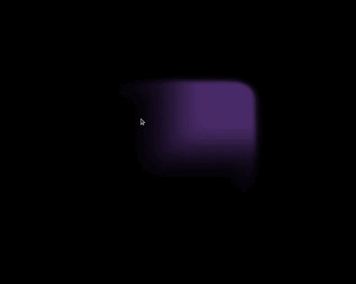
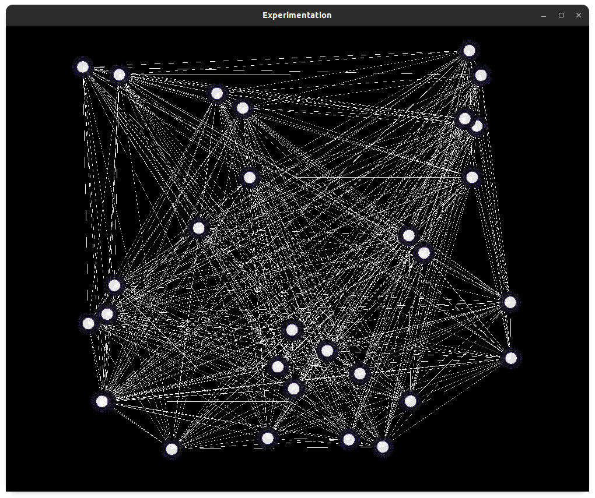

# GLTemplate : OpenGL application abstraction

## Example

### Real time fluid simulation (Joe Stam)


### Graph Representation



## Usage

### Abstract Class Application

A program that uses this paradigm should look like :
```
class ExampleApp : public App
{
public:
    void Startup() override {}           // Initialize OpenGL or GLtemplate objects
    void Render() override {}            // Manual Rendering protocole
    void ProcessInput() override {}      // Manual Input Management (on top of default ones)
    void Shutdown() override {}          // Manual Memory cleaning
private:
    int member;
}

DECLARE_MAIN(ExampleApp);
```

The main will look like :
```   
   - Glad and GLFW initialization
   - while loop with :
       - framerate management
       - rendering
       - input management
   - memory cleaning
```

This library also provides primitives that will makes things easier, for example :
```
class ExamplePrimitiveApp : public App
{
public:
    void Startup() override {
         disk.Create();
         AddShape(&disk);
    }
private:
    Disk disk;
}
```

We can use this to avoid writing basic OpenGL blocks every time.  
The application abstraction will hold many elementary functions that could be used to construct complex OpenGL application by assembling them together.